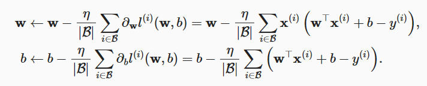
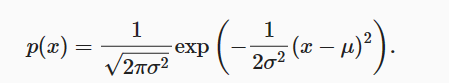
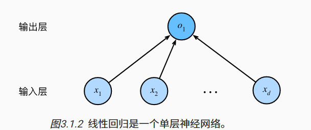

## 线性回归
在机器学习领域回归大多与预测(prediction)有关。
### 线性回归的基本元素
线性回归基于几个基本的假设:
- 假设自变量与因变量之间的关系是线性的，即y可以表示x中元素的加权和
- 允许包含的噪声比较正常，如噪声遵循正态分布

训练数据集(training data set)或训练集(training set):训练模型的数据集
样本(sample)/数据点(data point)/数据样本(data instance):数据集中的一行样本
标签(label)/目标(target):预测的目标
特征(feature)/协变量(covariate):预测所依据的自变量

### 线性模型
$y=w_1 x_1++w_2 x_2+b$
$w_1$和$w_2$称为权重(weight)，<mark>权重决定了每个特征对我们预测值的影响</mark>
$b$称为偏置(bias)/偏移量(offset)/截距(intercept),<mark>偏置指所有特征都为0时，预测值应为多少，它提升了模型的表达能力</mark>

线性模型其实是一个<mark>仿射变换(sffine transformation)</mark>，仿射变换的特点是通过加权和对特征进行线性变换，通过偏置项来进行平移

因为在深度学习中，使用的是高维数据集，所以采用矩阵表示比较方便。
对于单个样本来说：
$\hat{y}=\bold{w}^T\bold{x}+b$
对于多个样本来说：
$\hat{y}=\bold{w}\bold{X}+b$

我们的目的是，给定训练数据特征X和对应的标签y，线性回归的目标是找到一组权重向量w和偏置b，使得样本预测标签的误差尽可能小。

<mark>找到一个数据集使得模型的预测值与标签值完全相同是极为困难的，因此我们会加入噪声来考虑观测误差带来的影响。</mark>

### 损失函数-对模型拟合程度的度量
损失函数能够量化目标的实际值与预测值之间的差距。

<mark>度量模型在整个数据集上的质量时，我们需要计算在训练集n个样本上的损失均值。</mark>

在训练模型时，我们希望寻找一组参数$(w^*,b^*)$,这组参数能最小化在所有训练样本上的损失:
$\bold{w}^*,b^*=\displaystyle \argmin_{\bold{w},b}(\bold{w},b)$
### 解析解
线性回归刚好是一个简单的优化问题，与其他大部分模型不同，线性回归的解为解析解。

解析解：<mark>是一些严格的公式，给出任意的自变量就可以求出其因变量</mark>

数值解:<mark>只能得到一个数值答案，但是无法给定自变量得到因变量大小</mark>

### 随机梯度下降(stochastic gradient descent)
这种方法几乎可以优化所有的深度学习模型，它通过不断在损失函数递减的方向上更新参数来降低误差。

由于每一次更新参数都需要遍历整个数据集，因此我们通常会在每次需要计算更新的时候随机抽取一小批样本，称为<mark>小批量随机梯度下降(minibatch stochastic gradient descent)</mark>

该算法的步骤:
- 1.初始化模型参数的值
- 2.从数据集中随机抽取小批量样本且在负梯度的方向上更新参数
- 3.迭代

其中，$\eta$ 表示学习率，$|\Beta|$表示每个小批量中的样本数，称为批量大小(batch size)。

这些可以在调整但并不在训练过程中更新的参数称为超参数(hyperpaameter),<mark>调参(hyperparameter tuning)</mark>是选择超参数的过程。

训练迭代结果是在独立的验证数据集(validation dataset)上评估得到的。

最后当模型停止迭代后，得到的参数并不能真正使损失函数达到最小值，因为算法会使得损失向最小值缓慢收敛，但却不一定能够达到最小值。

对很多深度学习模型来说，损失平面上通常包含多个极小值，我们并不需要寻找到真正的最小值。

### 矢量化加速
在面对大量的高维数据时，我们可以通过矢量化来代替开销高昂的for循环。

矢量化代码通常会带来数量级的加速。

### 正态分布与平方损失

正态分布(Normal Distribution)又称为高斯分布(Gaussian Distribution)

对于线性模型来说，引入的噪声服从正态分布，也就是噪声的均值为0，$\epsilon\backsim\Nu(0,\sigma^2)$
$y=\bold{w}^T\bold{x}+b+\epsilon$

所以，y也近似服从正态分布$y\backsim N(\bold{w}^T\bold{x}+b,\sigma^2)$

所以给定$\bold{x}$，观测到特定的y的似然，在这里y就是随机变量，$\bold{w}^T{x}-b$就是均值:
$P(y|x)=\frac{1}{\sqrt{2\pi \sigma^2}}exp{(-\frac{1}{2\sigma^2}(y-\bold{w}^T{x}-b)^2)}$

对于整个模型来说，利用极大似然法可以寻找到参数$w^*$和$x^*$使得模型的拟合程度最大，拟合程度也可以理解为数据集中每个样本预测与标签的一致程度。

$P(\bold{y}|\bold{X})=\prod^n_{i=1}p(y^{(i)}|x^{(i)})$

我们通常会使用对数化，将乘法转化为加法:
$logP(\bold{y}|\bold{X})=-\sum^n_{i=1}\frac{1}{2}log(2\pi \sigma^2)-\frac{1}{2\sigma^2}(y^{(i)}-\bold{w}^Tx^{(i)}-b)^2$

因为在最优化中，我们一般使用的是最小化，所以这里我们计算负对数:
$-logP(\bold{y}|\bold{X})=\sum^n_{i=1}\frac{1}{2}log(2\pi \sigma^2)+\frac{1}{2\sigma^2}(y^{(i)}-\bold{w}^Tx^{(i)}-b)^2$

### 神经网络图
深度学习从业者喜欢绘制图表来可视化模型中正在发生的事。

对于线性回归，每个输入都与一个输出相连，我们称为全连接层(fully-connected layer)或者稠密层(dense layer)

## 从零开始线性回归
### 生成数据集
### 读取数据集
训练模型时因为每次抽取一小批量样本，并使用它们来更新我们的模型。所以我们需要编写函数来打乱数据集中的样本并以小批量的方式来获取数据。

我们可以利用GPU并行计算的优势，处理合理大小的"小批量"。每个样本都可以并行地被计算，使得处理几百个样本所用的时间不比处理一个样本多太多时间。

在深度学习中，实现内置迭代器效率比循环高得多。

### 初始化模型参数
在进行随机梯度下降之前，需要先有一些参数，所以我们首先需要进行初始化。

### 定义模型
### 定义损失函数
### 定义优化算法

在机器学习中，我们通常不太关心恢复真正的参数，而更关心如何高度准确地预测参数。幸运的是，即使在更复杂的优化问题中，随机梯度下降也能找到非常好的解，因为在深度网络中存在许多参数组合能够实现高度精确地预测。

